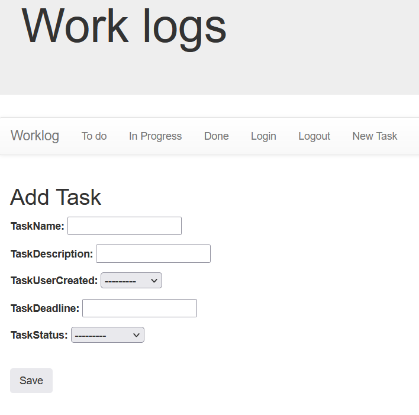
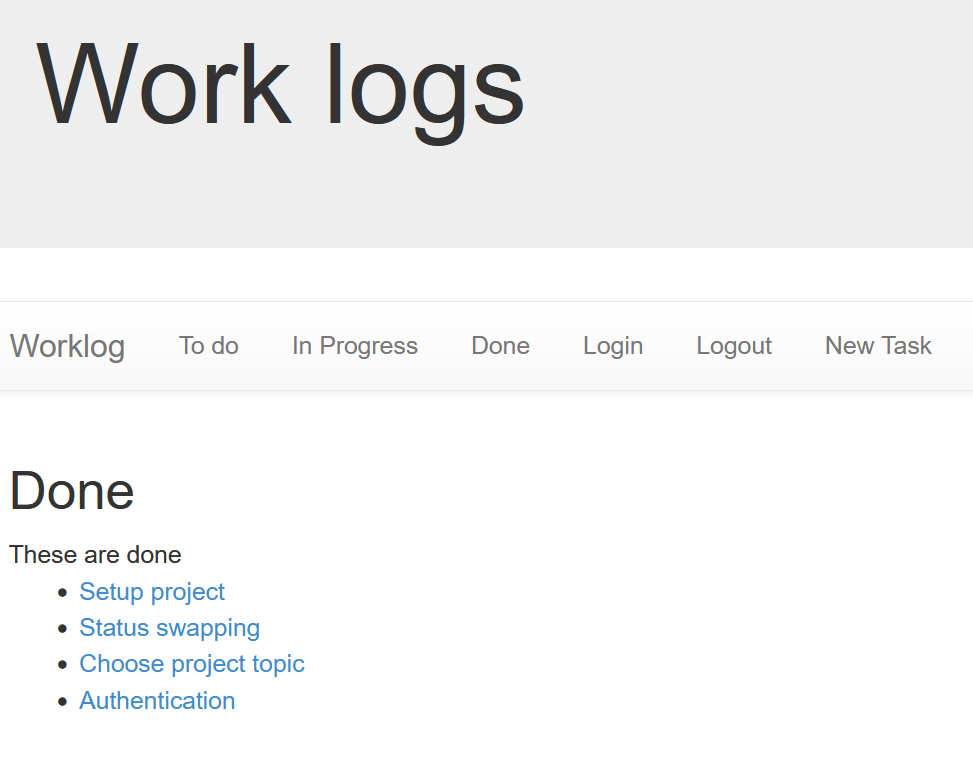
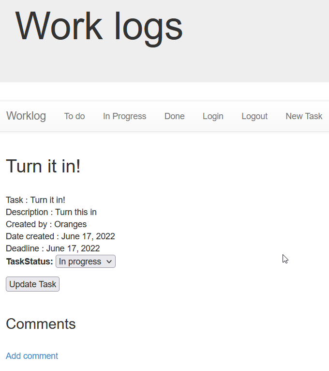

# Worklog

This is an assignment for IT112. This Django project is intended to be ased as an tracker for general project development within a group setting. You can create tasks, organize them by their completion status, and comment on said tasks to collobarate with your group.

Group members
* Louis Ash-Kaufman
* Lars Swenson
* Kelly Chapman
* Pablo Contreras
